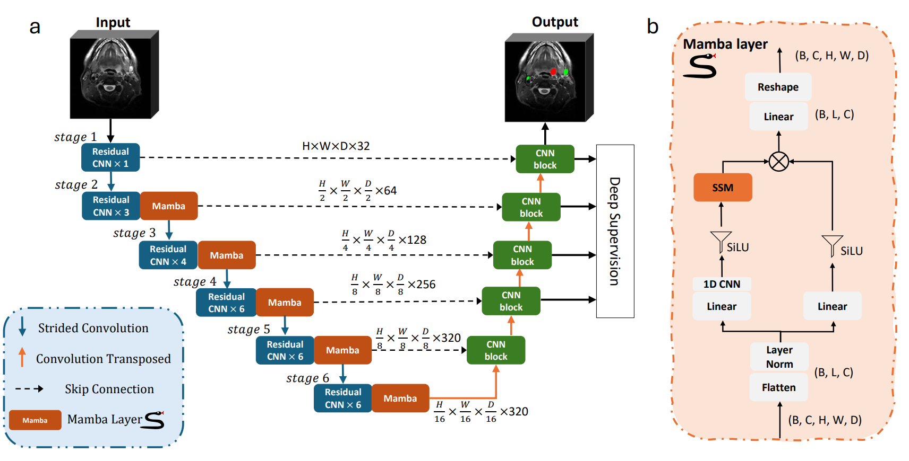

# UMambaAdj: Advancing Medical Image Segmentation with UMamba and nnU-Net ResEnc Planner
This repository contains the code and model for UMambaAdj, a hybrid network combining UMamba and nnU-Net Residual Encoder (ResEnc) designed for T2-weighted 3D medical image segmentation. 


UMambaAdj leverages the long-range dependency capabilities of the Mamba block and the feature extraction strength of the residual encoder to improve segmentation performance. The model was tested on the HNTS-MRG 2024 dataset, achieving enhanced accuracy in boundary delineation and volumetric overlap metrics.

The shared model weights are public available at : 
[](https://huggingface.co/JintaoRen/umambaadj/)


### Key Modifications of UMamba Adjustment (UMambaAdj)
- **Removal of the Mamba Layer and Residual Blocks**: We optimize UMamba by removing the Mamba layer in the first block and the residual blocks in the decoder, significantly enhancing computational efficiency while preserving the model's ability to capture long-range dependencies.
- **Integration with nnU-Net ResEnc**: By combining UMamba’s long-range dependency modeling with nnU-Net ResEnc’s enhanced residual encoding.

## Source code
Folder ```nnUNet``` presents the customized version of nnUNet for UMambaAdj.

## Environment
The source code was tested in environment with Python 3.12.4, PyTorch 2.4.0, CUDA 12.6 and nnU-Net 2.5.1. Distance metrics were calculated using SimpleITK 2.4.0.
